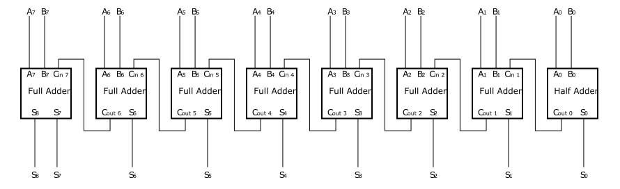

[](https://github.com/Pinzauti/garbled-circuit/actions/workflows/pylint.yml)
[](https://github.com/Pinzauti/garbled-circuit/actions/workflows/codeql-analysis.yml)
[](https://bettercodehub.com)

# Garbled Circuit

The purpose of this project is to develop a Yao's protocol[^fn3]
implementation. The function used is the sum which is performed on 8
bits number, using the circuit in
figure [1]. Alice
and Bob have two sets of numbers (given by the user), they compute the
sum of this set on their own. Then they execute the secure sum of their
set's sum using Yao's protocol.

Alice is the garbler, she creates the circuit which sends along with her
input to Bob, which is the circuit evaluator. Bob then computes the
results which sends to Alice.

The circuit used in this project is composed of an half adder and seven
full adders in series[^fn2].


|  |
|:--:|
| <b>Circuit used</b>|

|  |
|:--:|
| <b>Full adder</b>|

| |
|:--:|
| <b>Half adder</b>|

## Architecture

The structure of the src folder is the following:

-   `circuit/add.json`: contains the circuit.

-   `input/alice.txt`: Alice's input, it should be inserted by the user.

-   `input/bob.txt`: Bob's input, it should be inserted by the user.

-   `output/result.txt`: the result of the computation and other
    information, it is generated by the script.

-   `yao/`: contains the library[^fn1].

-   `main.py`: contains the main logic of the script.

-   `MAKEFILE`: contain the commands to be executed.

-   `requirements.txt`: the packages required to run the script.

-   `utils.py`: contains some useful functions used in main.

## The protocol

The steps of Alice are the following:

```
Function Alice(inputs, circuit):
  input-alice ← map-wires(input)
  circuit ← read-circuit(circuit)
  keys-alice ← rand-keys-AES()
  truth-table ← init-circuit(circuit)
  circuit-enc ← ENCkeys−a(truth − table)
  garbled-circuit ← garble(circuit-enc)
  keys-for-Bob ← select-keys-for-Bob(keys-a)
  result ← Bob(garbled-circuit, keys-for-Bob, Bob-input)
  return result
```

The steps of Bob are the following:

```
Bob(garbled, keys-a, input):  
  input-b ← map-wires(input)  
  while end-circuit-is-evaluated do  
     decrypted-gate ← use-keys(keys-a)  
    keys-b ← oblivion-transfer(decrypted-gate, bob-input)  
  end  
  message ← decrypted-gate  
  return message  
```

## Usage

### Installation

This project requires Python 3.10 or newer. In order to use this project
all the required packages have to be installed, in order to do this
execute the command[^1]:

```
cd src/
pip install -r requirements.txt
```

### Inputs

This script accepts a single line of integers separate by a space
character. There are two files, one for Bob's input, `bob.txt` and one
for Alice's input: `alice.txt`. Both files accepts as many numbers as
desired as long as the sum of them does not exceed 255, which is the
maximum number representable as a single byte, which is the size of our
circuit.

### Commands

Open a terminal and execute the following commands:

```
cd src/  
make bob
```

Then open another terminal (while leaving the other one open) and
execute the following commands:

```
cd src/  
make alice
```

Those commands are sufficient in order to execute the script, in
addition to that you can print a clear representation of the garbled
table of the circuit with the following commands:

```
cd src/  
make table
```

[^1]: Depending on the installation it could be required to run pip3
    instead of pip, it is always suggested to create a virtual
    environment before the installation.
    
[^fn1]: [Roq21] Olivier Roques. Garbled circuit. [Accessed Jan-2022]. 2021.
[^fn2]: [Wik21a] Wikipedia contributors. Adder (electronics) — Wikipedia, The Free
Encyclopedia. [Online; accessed January-
2022]. 2021.
[^fn3]: [Wik21b] Wikipedia contributors. Secure two-party computation — Wikipedia,
The Free Encyclopedia. [Online; accessed 20-January-2022]. 2021.
